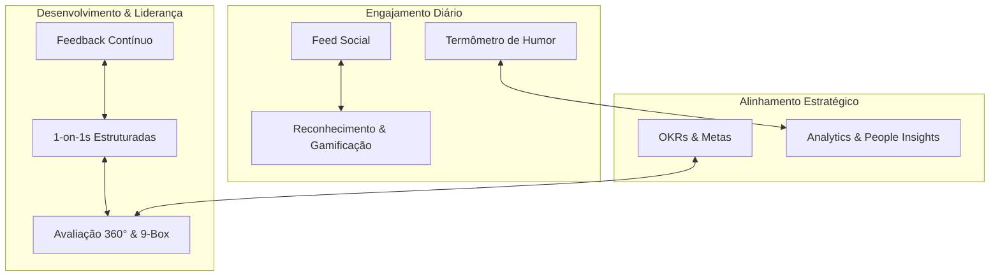

# SocialTool RH

> Plataforma opensource de engajamento e gestão de pessoas: rede social interna com reconhecimento contínuo, humor diário, feedback, 1-on-1, OKRs, avaliações 360° e analytics de clima. Cada organização instala e configura a sua própria.

---

## 📌 Visão

Uma plataforma "all-in-one" para times de RH e liderança operarem cultura como sistema, não como campanha esporádica: comunicação com propósito, reconhecimento medido em moeda simbólica, humor e clima capturados diariamente, e um espelho analítico para agir antes do problema virar turnover.



> **Estado atual:** Fase 1 (feed, reconhecimento com SocialCoins, humor diário, autenticação com convite por e-mail e login com Google Workspace). Os demais módulos vivem em `docs/` como especificação — ainda não implementados. Ver [CLAUDE.md](CLAUDE.md) para o mapa real do que existe em código vs. o que está no roadmap.

---

## 🛠️ Stack

| Camada | Tecnologia |
| :--- | :--- |
| Backend | C# .NET 10, ASP.NET Core Web API, controllers MVC |
| ORM & Banco | Entity Framework Core 10 + Pomelo MySQL, MySQL 8.4 |
| Realtime | SignalR / WebSockets (backend pronto; front ainda por plugar) |
| Frontend | React 19 + TypeScript, Vite 8, Tailwind 4, `lucide-react`, `oxlint` |
| Infra local | Docker Compose (MySQL + Adminer) |

> Ver `docs/02-arquitetura-tecnica.md` para a stack **planejada** completa (MediatR/CQRS, Redis, filas de background, biblioteca de componentes). Nada disso está instalado hoje.

---

## 🚀 Rodar localmente

### Pré-requisitos

- [.NET 10 SDK](https://dotnet.microsoft.com/download) (preview)
- [Node.js 20+](https://nodejs.org/) e npm
- [Docker](https://docs.docker.com/get-docker/) e Docker Compose

### Passo a passo

```bash
# 1. clonar
git clone https://github.com/pacmanalx/socialtool-rh.git
cd socialtool-rh

# 2. subir o banco (MySQL 8.4), o Adminer e a caixa de e-mail de desenvolvimento (Mailpit)
cp .env.example .env
docker compose up -d

# 3. backend — migra e semeia na primeira subida
cd backend
dotnet build
dotnet run --project src/SocialTool.Api
# → http://localhost:5000
#   OpenAPI em http://localhost:5000/openapi/v1.json (Development)

# 4. frontend — em outro terminal
cd frontend
npm install
npm run dev
# → http://localhost:3000
```

- **Adminer** (UI web pra inspecionar o banco) sobe em `http://localhost:8080` — servidor `db`, usuário `socialtool`, senha `socialtool_dev`, base `socialtool`.
- **Mailpit** (caixa de e-mail de desenvolvimento) sobe em `http://localhost:8025`. Com o envio ligado (veja abaixo), todo convite e toda redefinição de senha enviados localmente caem ali, sem sair para a internet.

> **E-mail protegido por padrão.** Todo e-mail sai por um único wrapper com duas travas no `appsettings.json`: `Email:Enabled` (trava geral, `false` por padrão: nada sai) e `Email:Redirect` (desvio, ligado por padrão: todo e-mail vai para `Email:Redirect:To`, nunca para o usuário real; com o destino vazio, nada sai). Só com `Email:Redirect:Enabled=false` algum e-mail chega a um usuário real. Para testar localmente, crie `appsettings.Development.json` (fica fora do git) com `"Email": { "Enabled": true, "Redirect": { "Enabled": true, "To": "voce@exemplo.com" } }` — os e-mails caem no Mailpit endereçados a você, com o assunto marcado "[Desviado de ...]".

> **macOS:** a porta 5000 costuma estar ocupada pelo Receptor AirPlay. Rode o backend em outra porta e aponte o front para ela:
> `ASPNETCORE_URLS=http://localhost:5100 dotnet run --project src/SocialTool.Api` e `VITE_API_URL=http://localhost:5100 npm run dev`.

### O que esperar na primeira subida

- O banco é criado e migrado automaticamente.
- Em `Development`, uma organização de exemplo ("Demo Company") é semeado com 5 usuários. Entre com `alexandre.pereira@example.com` (Administrador) ou `juliana.santos@example.com` (RH), senha **`socialtool-dev`**. Esses dados de exemplo **não** são criados fora de `Development`.
- Não há login automático: a tela inicial é o login.

> Se o seu banco local foi criado por uma versão anterior do projeto (antes da migration única `InitialCreate` atual), ele não migra: recrie do zero com `docker compose down -v && docker compose up -d`.

---

## 🔐 Autenticação e usuários

- **Entrada só por convite.** Administrador ou RH cadastra a pessoa em **Administração → Usuários**; ela recebe um e-mail com um link (válido por 72 h) para criar a senha. Não existe auto-cadastro.
- **Senha:** mínimo de 10 caracteres, guardada com BCrypt. "Esqueci minha senha" envia um link válido por 60 min; redefinir ou trocar a senha encerra as outras sessões abertas.
- **Sessão:** access token JWT de 15 min, mantido só em memória no navegador, e refresh token rotativo em cookie `httpOnly` + `SameSite=Strict` (14 dias). Se um refresh token já usado for reapresentado, todas as sessões da pessoa são derrubadas.
- **Importação do Google Workspace:** em **Administração → Usuários → Importar do Workspace**, envie o JSON de "Fazer o download dos usuários" do Admin Console. A tela mostra a comparação antes de gravar. A importação é incremental: e-mail novo vira usuário (sem senha e sem convite), e-mail existente só tem cargo e departamento preenchidos se estiverem vazios, contas que nunca entraram no Google e suspensas ficam de fora por padrão, e reimportar o mesmo arquivo não muda nada. A lista de usuários separa quem já acessou de quem nunca acessou. Para quem nunca acessou, dá para enviar o convite por e-mail um a um ou em lote ("Selecionar quem nunca acessou" → "Enviar convite por e-mail"), então conectar o Workspace nunca é obrigatório: todo mundo pode entrar pelo mesmo caminho do convite.
- **Papéis:** Administrador, RH, Líder e Colaborador. RH convida pessoas e edita cadastros; mudar papel, desativar e reativar contas é exclusivo do Administrador. Desativar corta o acesso imediatamente.

### Login com Google Workspace (opcional)

1. No [Google Cloud Console](https://console.cloud.google.com/apis/credentials), crie um **ID do cliente OAuth** do tipo *Aplicativo da Web* e adicione a URL do front (ex.: `http://localhost:3000`) em **Origens JavaScript autorizadas**.
2. Informe o Client ID ao backend: `Auth__Google__ClientId=<seu-client-id>` (variável de ambiente) ou `Auth:Google:ClientId` em `appsettings.Development.json`.
3. Como administrador, em **Administração → Usuários → Configurações da organização**, informe os domínios do Google Workspace, um por linha (ex.: `empresa.com.br`). Um Workspace pode ter vários domínios; liste todos os que devem entrar.

O Google só autentica quem **já foi convidado** e tem conta nesse domínio. Contas pessoais (`@gmail.com`) ou de outros domínios são recusadas.

### Colocando no ar (primeiro administrador)

Cada instalação atende **uma organização**. Fora de `Development` não há dados de exemplo: na primeira subida, com o banco vazio, a organização e o primeiro administrador nascem da configuração `Bootstrap`:

```bash
Bootstrap__OrganizationName="Minha Empresa"
Bootstrap__AdminName="Nome do Admin"
Bootstrap__AdminEmail="admin@minhaempresa.com.br"
Bootstrap__GoogleWorkspaceDomains="minhaempresa.com.br,minhaempresa.com"   # opcional; um ou mais, separados por vírgula
```

O administrador recebe um convite por e-mail e, depois de entrar, ajusta nome, moeda e cota mensal em **Configurações da organização**. Se o e-mail falhar, use "Esqueci minha senha" com o mesmo endereço. Antes de subir fora de `Development`, configure também:

- `Jwt__SecretKey`: segredo próprio com pelo menos 32 bytes. O backend **se recusa a subir** com o valor de exemplo.
- `Email__Smtp__Host`, `Email__Smtp__Port`, `Email__Smtp__User`, `Email__Smtp__Password`, `Email__FromAddress`: o servidor SMTP real, `Email__Enabled=true` para ligar o envio e `Email__Redirect__To=voce@empresa.com.br` para, enquanto o desvio estiver ligado, receber você todos os e-mails no lugar dos usuários. Só `Email__Redirect__Enabled=false` libera o envio real. Com o envio desligado, o primeiro administrador não recebe convite: ele entra pelo Google ou você liga o envio com o desvio para você mesmo e usa "Esqueci minha senha".
- `App__PublicUrl`: a URL pública do front, usada nos links dos e-mails.
- `Cors__AllowedOrigins__0`: só se o front for servido de outra origem que não a da API.

---

## 📚 Documentação

A documentação está em [`docs/`](docs/):

1. 📄 [**01. Visão Geral e Negócio**](docs/01-visao-geral.md) — Personas, dores, modelo de distribuição, proposta de valor.
2. 🏛️ [**02. Arquitetura Técnica**](docs/02-arquitetura-tecnica.md) — Clean Architecture, CQRS, multi-tenancy, SignalR e organização do frontend.
3. 📦 **03. Especificações dos Módulos Funcionais**:
   - 📢 [Feed Social & Celebrações](docs/03-modulos-funcionais/01-feed-social-e-celebracoes.md)
   - 🏆 [Reconhecimento & Gamificação](docs/03-modulos-funcionais/02-reconhecimento-e-gamificacao.md)
   - 💬 [Feedback Contínuo & Reuniões 1-on-1](docs/03-modulos-funcionais/03-feedback-e-one-on-one.md)
   - 📊 [Pesquisas de Clima, Humor & eNPS](docs/03-modulos-funcionais/04-pesquisas-clima-enps.md)
   - 🎯 [Gestão de OKRs & Metas](docs/03-modulos-funcionais/05-okrs-e-metas.md)
   - 🌟 [Avaliação de Desempenho & Avaliação 360°](docs/03-modulos-funcionais/06-avaliacao-desempenho-360.md)
4. 🗄️ [**04. Modelo de Dados Relacional (MySQL)**](docs/04-modelo-dados-mysql.md) — DDLs, tabelas principais, relacionamentos e índices.
5. 🛡️ [**05. Segurança, RBAC & Conformidade LGPD**](docs/05-seguranca-lgpd-permissoes.md) — Níveis de permissão, política de privacidade, criptografia e anonimização.
6. 🚀 [**06. Roadmap e Fases de Implementação**](docs/06-roadmap-implementacao.md) — MVP, Fase 2 (Engajamento Avançado) e Fase 3 (Analytics & Inteligência Preditiva).
7. 🔍 [**07. Análise Estrutural de Plataforma de Referência**](docs/07-analise-plataforma-referencia.md) — Estudo de arquitetura de informação, widgets, humor de 5 níveis, pesquisas e painel de desengajados.

Leia [CLAUDE.md](CLAUDE.md) para as convenções técnicas, armadilhas conhecidas e o mapa entre docs (intenção) e código (implementação real).

---

## 📂 Estrutura de pastas

```
socialtool-rh/
├── backend/
│   └── src/
│       ├── SocialTool.Api/            # controllers, DTOs, hubs, middleware, seed
│       ├── SocialTool.Application/    # interfaces (casca — sem handlers/CQRS)
│       ├── SocialTool.Domain/         # entidades e enums
│       └── SocialTool.Infrastructure/ # ApplicationDbContext, migrations, serviços
├── frontend/
│   ├── public/                        # favicon, sprite de ícones
│   └── src/
│       ├── components/                # feed, layout, widgets (Tailwind inline)
│       ├── context/                   # AuthContext
│       ├── services/api.ts            # único wrapper fetch
│       └── types/                     # tipos espelhados do backend
├── docs/                              # documentação de produto e arquitetura
├── docker-compose.yml                 # MySQL + Adminer para desenvolvimento local
├── .env.example                       # template das variáveis de ambiente
└── CLAUDE.md                          # convenções e mapa técnico do repositório
```

---

## 🤝 Contribuindo

Este é um projeto opensource em fase inicial. Issues, discussões e PRs são bem-vindos — leia o [CONTRIBUTING.md](CONTRIBUTING.md) antes de começar. Para vulnerabilidades de segurança, siga o [SECURITY.md](SECURITY.md). Ao participar, você concorda com o nosso [Código de Conduta](CODE_OF_CONDUCT.md).

Se for a sua primeira vez lendo o repositório, comece pelo [CLAUDE.md](CLAUDE.md) — evita 80% dos falsos desalinhamentos entre o que está documentado como intenção em `docs/` e o que existe hoje em código.

---

## 📄 Licença

Distribuído sob a [Licença MIT](LICENSE). Consulte o arquivo para o texto completo.
