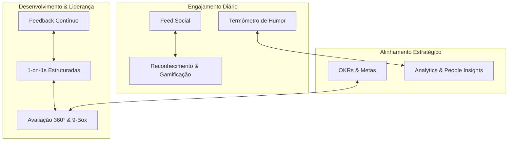

# SocialTool RH

> Plataforma opensource de engajamento e gestão de pessoas: rede social interna com reconhecimento contínuo, humor diário, feedback, 1-on-1, OKRs, avaliações 360° e analytics de clima — tudo multi-tenant.

---

## 📌 Visão

Uma plataforma "all-in-one" para times de RH e liderança operarem cultura como sistema, não como campanha esporádica: comunicação com propósito, reconhecimento medido em moeda simbólica, humor e clima capturados diariamente, e um espelho analítico para agir antes do problema virar turnover.



> **Estado atual:** bancada de demonstração da Fase 1 (feed, reconhecimento com SocialCoins, humor diário, login demo). Os demais módulos vivem em `docs/` como especificação — ainda não implementados. Ver [CLAUDE.md](CLAUDE.md) para o mapa real do que existe em código vs. o que está no roadmap.

---

## 🛠️ Stack

| Camada | Tecnologia |
| :--- | :--- |
| Backend | C# .NET 10, ASP.NET Core Web API, controllers MVC |
| ORM & Banco | Entity Framework Core 10 + Pomelo MySQL, MySQL 8.4 |
| Realtime | SignalR / WebSockets (backend pronto; front ainda por plugar) |
| Frontend | React 19 + TypeScript, Vite 8, Tailwind 4, `lucide-react`, `oxlint` |
| Infra local | Docker Compose (MySQL + Adminer) |

> Ver `docs/02-arquitetura-tecnica.md` para a stack **planejada** completa (MediatR/CQRS, Redis, filas de background, biblioteca de componentes). Nada disso está instalado hoje.

---

## 🚀 Rodar localmente

### Pré-requisitos

- [.NET 10 SDK](https://dotnet.microsoft.com/download) (preview)
- [Node.js 20+](https://nodejs.org/) e npm
- [Docker](https://docs.docker.com/get-docker/) e Docker Compose

### Passo a passo

```bash
# 1. clonar
git clone https://github.com/pacmanalx/socialtool-rh.git
cd socialtool-rh

# 2. subir o banco (MySQL 8.4 + Adminer)
cp .env.example .env
docker compose up -d db

# 3. backend — migra e semeia na primeira subida
cd backend
dotnet build
dotnet run --project src/SocialTool.Api
# → http://localhost:5000
#   OpenAPI em http://localhost:5000/openapi/v1.json (Development)

# 4. frontend — em outro terminal
cd frontend
npm install
npm run dev
# → http://localhost:3000
```

**Adminer** (UI web pra inspecionar o banco) sobe em `http://localhost:8080` — servidor `db`, usuário `socialtool`, senha `socialtool_dev`, base `socialtool`.

### O que esperar na primeira subida

- O banco é criado e migrado automaticamente.
- Um tenant demo é semeado com um punhado de usuários. A senha de todos é `123456` (é uma **bancada de demo**, não um modelo de auth para produção).
- O frontend faz login automático de um usuário demo para agilizar a exploração.

---

## 📚 Documentação

A documentação está em [`docs/`](docs/):

1. 📄 [**01. Visão Geral e Negócio**](docs/01-visao-geral.md) — Personas, dores, modelo SaaS multi-tenant, proposta de valor.
2. 🏛️ [**02. Arquitetura Técnica**](docs/02-arquitetura-tecnica.md) — Clean Architecture, CQRS, multi-tenancy, SignalR e organização do frontend.
3. 📦 **03. Especificações dos Módulos Funcionais**:
   - 📢 [Feed Social & Celebrações](docs/03-modulos-funcionais/01-feed-social-e-celebracoes.md)
   - 🏆 [Reconhecimento & Gamificação](docs/03-modulos-funcionais/02-reconhecimento-e-gamificacao.md)
   - 💬 [Feedback Contínuo & Reuniões 1-on-1](docs/03-modulos-funcionais/03-feedback-e-one-on-one.md)
   - 📊 [Pesquisas de Clima, Humor & eNPS](docs/03-modulos-funcionais/04-pesquisas-clima-enps.md)
   - 🎯 [Gestão de OKRs & Metas](docs/03-modulos-funcionais/05-okrs-e-metas.md)
   - 🌟 [Avaliação de Desempenho & Avaliação 360°](docs/03-modulos-funcionais/06-avaliacao-desempenho-360.md)
4. 🗄️ [**04. Modelo de Dados Relacional (MySQL)**](docs/04-modelo-dados-mysql.md) — DDLs, tabelas principais, relacionamentos, isolamento por `tenant_id` e índices.
5. 🛡️ [**05. Segurança, RBAC & Conformidade LGPD**](docs/05-seguranca-lgpd-permissoes.md) — Níveis de permissão, política de privacidade, criptografia e anonimização.
6. 🚀 [**06. Roadmap e Fases de Implementação**](docs/06-roadmap-implementacao.md) — MVP, Fase 2 (Engajamento Avançado) e Fase 3 (Analytics & Inteligência Preditiva).
7. 🔍 [**07. Análise Estrutural de Plataforma de Referência**](docs/07-analise-plataforma-referencia.md) — Estudo de arquitetura de informação, widgets, humor de 5 níveis, pesquisas e painel de desengajados.

Leia [CLAUDE.md](CLAUDE.md) para as convenções técnicas, armadilhas conhecidas e o mapa entre docs (intenção) e código (implementação real).

---

## 📂 Estrutura de pastas

```
socialtool-rh/
├── backend/
│   └── src/
│       ├── SocialTool.Api/            # controllers, DTOs, hubs, middleware, seed
│       ├── SocialTool.Application/    # interfaces (casca — sem handlers/CQRS)
│       ├── SocialTool.Domain/         # entidades, enums, ITenantEntity
│       └── SocialTool.Infrastructure/ # ApplicationDbContext, migrations, serviços
├── frontend/
│   ├── public/                        # favicon, sprite de ícones
│   └── src/
│       ├── components/                # feed, layout, widgets (Tailwind inline)
│       ├── context/                   # AuthContext
│       ├── services/api.ts            # único wrapper fetch
│       └── types/                     # tipos espelhados do backend
├── docs/                              # documentação de produto e arquitetura
├── docker-compose.yml                 # MySQL + Adminer para desenvolvimento local
├── .env.example                       # template das variáveis de ambiente
└── CLAUDE.md                          # convenções e mapa técnico do repositório
```

---

## 🤝 Contribuindo

Este é um projeto opensource em fase inicial. Issues, discussões e PRs são bem-vindos — leia o [CONTRIBUTING.md](CONTRIBUTING.md) antes de começar. Para vulnerabilidades de segurança, siga o [SECURITY.md](SECURITY.md). Ao participar, você concorda com o nosso [Código de Conduta](CODE_OF_CONDUCT.md).

Se for a sua primeira vez lendo o repositório, comece pelo [CLAUDE.md](CLAUDE.md) — evita 80% dos falsos desalinhamentos entre o que está documentado como intenção em `docs/` e o que existe hoje em código.

---

## 📄 Licença

Distribuído sob a [Licença MIT](LICENSE). Consulte o arquivo para o texto completo.
