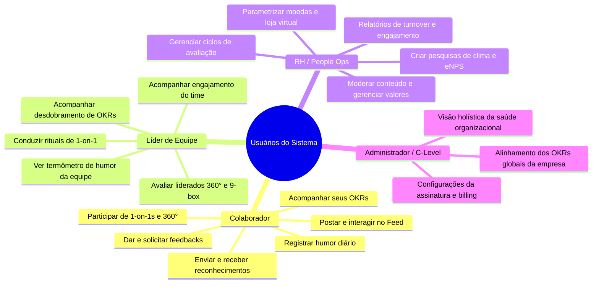

# 01. Visão Geral e Modelo de Negócio

## 🎯 Visão do Produto

O **SocialTool RH** é uma plataforma corporativa "all-in-one" de engajamento e gestão de pessoas, cujo propósito é transformar a cultura organizacional por meio do engajamento, transparência, escuta ativa e reconhecimento de equipes.

Diferente de redes sociais e comunicadores corporativos genéricos, o foco do SocialTool é estruturar as interações para que gerem **dados acionáveis para o RH** e **desenvolvimento real para as pessoas**.

---

## 👥 Personas do Sistema

---

## 💡 Dores de Mercado Resolvidas

| Problema Tradicional | Solução do SocialTool RH |
| :--- | :--- |
| **Comunicação interna dispersa** em e-mails e grupos informais sem registro ou retenção de cultura. | **Feed Social Corporativo** centralizado, categorizado por canais e valores da empresa. |
| **Falta de reconhecimento no dia a dia**, gerando desmotivação e turnover silencioso. | **Gamificação com moedas virtuais e badges** vinculados diretamente aos pilares da empresa. |
| **1-on-1s esquecidas ou improvisadas**, sem plano de ação ou histórico de alinhamento. | **Gestão de 1-on-1s** com pautas prévias, ata compartilhada, notas privadas e tarefas. |
| **Pesquisas de clima anuais demoradas**, onde os problemas já escalaram quando o resultado sai. | **Pesquisas de pulso ágeis e termômetro diário de humor**, capturando a variação em tempo real. |
| **Metas em planilhas desconectadas da rotina**, esquecidas após o início do trimestre. | **Gestão integrada de OKRs**, com check-ins semanais e vínculo com reconhecimentos. |
| **Avaliações de desempenho burocráticas**, com viés de recência e sem evidências históricas. | **Avaliação 360° e Matriz 9-Box** abastecida pelo histórico de feedbacks contínuos e 1-on-1s do ano. |

---

## 🏢 Modelo de Distribuição: Software Livre, Uma Instalação por Organização

A plataforma é **software livre (licença MIT)** e cada organização roda a **sua própria instalação**:

1. **Dados na casa de quem instala**: o banco, os e-mails e as integrações ficam na infraestrutura da própria organização. Uma instalação atende uma única organização — não existe mistura de dados entre empresas.
2. **Configuração pela própria organização** (pela interface de administração):
   - Nome, logotipo e cores institucionais.
   - Nome personalizado da moeda corporativa (ex: *Estrelas*, *Pontos de Valor*) e cota mensal por pessoa.
   - Definição dos **Valores da Cultura** que guiam os reconhecimentos.
   - Organograma, departamentos, cargos e níveis hierárquicos.
   - Integrações opcionais (e-mail, login e ferramentas de colaboração do Google Workspace).
3. **Adoção gradual**:
   - Ativação modular: a organização pode começar com Feed + Reconhecimento e habilitar Feedback, 1-on-1, OKRs e Avaliação 360° conforme amadurece.
   - Grupos com várias empresas ou marcas podem usar uma instalação por empresa ou uma única instalação com as marcas modeladas como unidades/departamentos.
