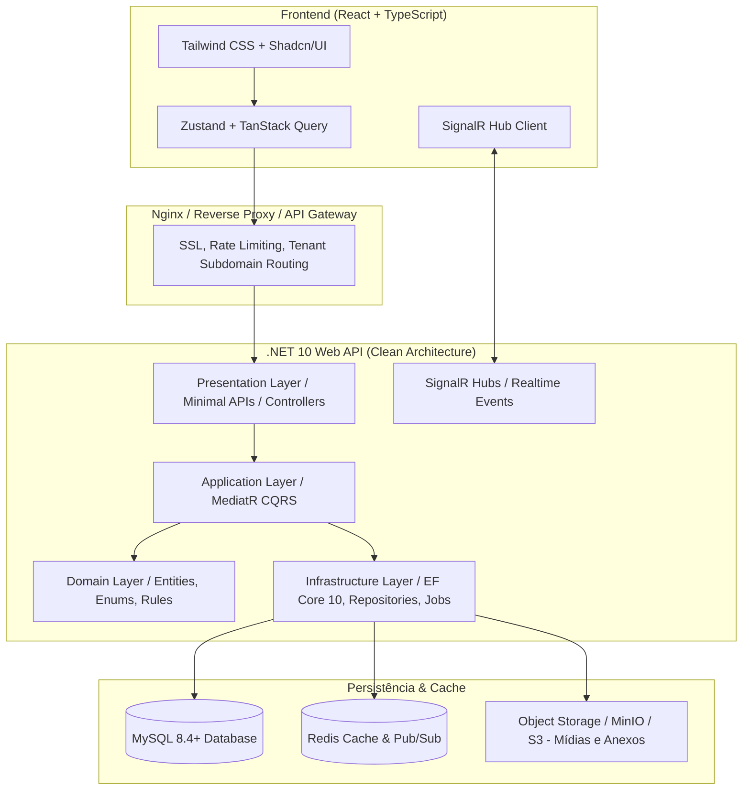

# 02. Arquitetura Técnica (.NET 10 + React + MySQL)

## 🏗️ Visão da Arquitetura

O sistema é construído seguindo os princípios de **Clean Architecture** (Arquitetura Limpa) e **Domain-Driven Design (DDD)** no backend, combinado a uma aplicação Single Page Application (SPA) em **React com TypeScript** no frontend.



---

## 💻 Backend: C# .NET 10

### 1. Estrutura de Camadas (Clean Architecture)

```
backend/
├── src/
│   ├── SocialTool.Domain/             # Entidades de domínio, Enums, Eventos de domínio, Interfaces
│   ├── SocialTool.Application/        # Casos de uso (Commands/Queries MediatR), DTOs, Validations (FluentValidation)
│   ├── SocialTool.Infrastructure/     # EF Core DbContext, Migrations, MySQL Repositories, Storage, E-mail
│   └── SocialTool.WebApi/             # Endpoints, Middlewares (Tenant, Auth, Exception), SignalR Hubs
└── tests/
    ├── SocialTool.Domain.Tests/
    ├── SocialTool.Application.Tests/
    └── SocialTool.IntegrationTests/
```

### 2. Multi-Tenancy no .NET 10 com EF Core

Para aliar eficiência de custos e escalabilidade em SaaS B2B, adota-se a estratégia de **Banco Compartilhado com Coluna Discriminadora (`TenantId`)** protegida por **Filtros Globais de Consulta (Global Query Filters)** no Entity Framework Core.

#### Resolução do Tenant via Middleware:
O tenant é identificado prioritariamente pelo subdomínio da requisição (ex: `empresa-acme.socialtool.com`) ou pelo cabeçalho HTTP `X-Tenant-Id`.

```csharp
// Exemplo conceitual do Tenant Middleware
public class TenantResolutionMiddleware
{
    private readonly RequestDelegate _next;

    public TenantResolutionMiddleware(RequestDelegate next) => _next = next;

    public async Task InvokeAsync(HttpContext context, ITenantContext tenantContext, ITenantRepository tenantRepo)
    {
        var tenantIdentifier = ResolveTenantIdentifier(context);
        if (!string.IsNullOrEmpty(tenantIdentifier))
        {
            var tenant = await tenantRepo.GetByIdentifierAsync(tenantIdentifier);
            if (tenant != null && tenant.IsActive)
            {
                tenantContext.SetTenant(tenant.Id, tenant.Name);
            }
        }
        await _next(context);
    }
}
```

#### Filtro Global Automático no `ApplicationDbContext`:
```csharp
public class ApplicationDbContext : DbContext
{
    private readonly ITenantContext _tenantContext;

    public ApplicationDbContext(DbContextOptions<ApplicationDbContext> options, ITenantContext tenantContext)
        : base(options)
    {
        _tenantContext = tenantContext;
    }

    public DbSet<Post> Posts => Set<Post>();
    public DbSet<Feedback> Feedbacks => Set<Feedback>();
    public DbSet<Recognition> Recognitions => Set<Recognition>();
    // ... demais DbSets

    protected override void OnModelCreating(ModelBuilder modelBuilder)
    {
        base.OnModelCreating(modelBuilder);

        // Aplica filtro multi-tenant automático a todas as entidades com ITenantEntity
        foreach (var entityType in modelBuilder.Model.GetEntityTypes())
        {
            if (typeof(ITenantEntity).IsAssignableFrom(entityType.ClrType))
            {
                modelBuilder.Entity(entityType.ClrType)
                    .HasQueryFilter(CreateTenantFilter(entityType.ClrType));
            }
        }
    }
}
```

### 3. Tempo Real com SignalR Hubs
- `FeedHub`: Dispara atualizações de novos posts, reações e comentários instantaneamente no mural da empresa (`Groups.AddToGroupAsync(Context.ConnectionId, tenantId)`).
- `NotificationHub`: Entrega notificações diretas ao usuário (quando recebe um feedback, reconhecimento, menção ou lembrete de 1-on-1).

---

## 🎨 Frontend: React + TypeScript

### 1. Estrutura de Pastas Orientada a Funcionalidades (Feature-driven)

```
frontend/
├── src/
│   ├── assets/              # Ícones e imagens estáticas
│   ├── components/          # Componentes globais de UI (Button, Modal, Avatar, Dropdown - Shadcn/UI)
│   ├── contexts/            # Contextos de Autenticação, Tenant e Tema
│   ├── hooks/               # Custom hooks reutilizáveis (useSignalR, useDebounce)
│   ├── lib/                 # Axios client, utilitários de data/formatação
│   ├── features/            # Módulos organizados por contexto de negócio:
│   │   ├── auth/            # Login, ativação de conta, recuperação de senha
│   │   ├── feed/            # Mural, criação de posts, reações, comentários
│   │   ├── recognition/     # Envio de reconhecimentos, extrato de moedas, catálogo de prêmios
│   │   ├── feedback/        # Solicitação e envio de feedbacks 1:1
│   │   ├── one-on-one/      # Agendamentos, pautas colaborativas, anotações de reunião
│   │   ├── surveys/         # Pesquisas de pulso e termômetro diário de humor
│   │   ├── okrs/            # Árvore de objetivos, resultados-chave e check-ins
│   │   └── performance/     # Ciclos de avaliação 360°, matriz 9-box e PDI
│   ├── router/              # Rotas protegidas (React Router v6+)
│   └── App.tsx
```

### 2. Gerenciamento de Estado
- **TanStack Query (React Query)**: Cache de requisições de servidor, paginação infinita para o Feed, invalidação automática de cache em mutações.
- **Zustand**: Estados globais leves de cliente (usuário logado, modal aberto, filtros ativos, status da conexão SignalR).

---

## 🐬 Banco de Dados: MySQL 8.4+

- **Driver .NET**: `Pomelo.EntityFrameworkCore.MySql` versão compatível com .NET 10.
- **CharSet e Collation**: `utf8mb4` e `utf8mb4_unicode_ci` (suporte integral a emojis em posts, reações e comentários).
- **Estratégia de Índices**: Índices compostos sempre iniciando por `tenant_id` (ex: `IX_Posts_TenantId_CreatedAt`), garantindo busca de alta performance por cliente.
- **Auditoria Padrão**: Todas as tabelas herdam campos de auditoria (`created_at`, `created_by`, `updated_at`, `updated_by`, `is_deleted`).
