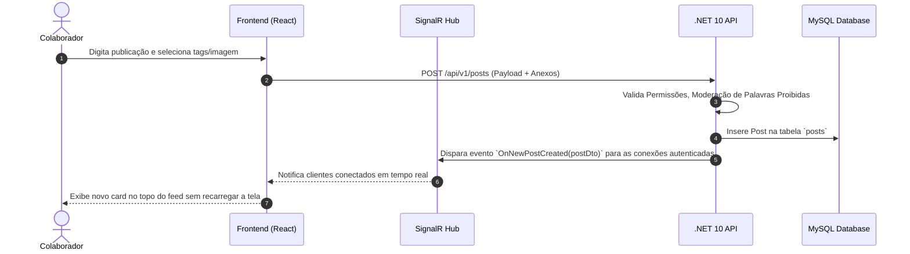

# Módulo 01: Feed Social & Celebrações

## 📌 Objetivo do Módulo

Servir como a praça central de convivência da organização. O **Feed Social** estimula o senso de pertencimento, alinhamento cultural e celebração de conquistas coletivas e individuais.

---

## 🚀 Funcionalidades Principais

### 1. Mural de Publicações Corporativas
- **Tipos de Publicações**:
  - `Post Padrão`: Texto com suporte a menções (`@usuario`), hashtags (`#tema`), imagens e vídeos (anexos).
  - `Comunicado Oficial`: Publicado exclusivamente por Administradores e RH. Ganha destaque fixado no topo do feed (*Pinned Post*) e envio opcional de notificação push/e-mail para toda a empresa.
  - `Celebração Automática`: Cards gerados pelo sistema comemorando:
    - **Aniversário de Vida**: Notifica e permite felicitar o aniversariante.
    - **Tempo de Casa (Aniversário de Empresa)**: Reconhece marcos (1 ano, 3 anos, 5 anos, etc.).
    - **Boas-vindas (Novo Colaborador)**: Apresenta o recém-chegado com cargo, departamento e uma breve bio de integração.

### 2. Interações Sociais
- **Reações Ricas**: Mais que um simples "curtir", oferece reações corporativas:
  - 👍 *Curtir*
  - 👏 *Palmas / Parabéns*
  - ❤️ *Amei / Orgulho*
  - 💡 *Inovador / Brilhante*
  - 🚀 *Sensacional / Foguete*
- **Comentários e Respostas Aninhadas**: Discussões estruturadas em cada publicação com menções a colegas.
- **Compartilhamento**: Envio de links diretos do post para canais de chat ou e-mail interno.

### 3. Filtros e Segmentação de Feed
- **Filtro Global**: Exibe postagens de toda a empresa.
- **Filtro por Departamento/Time**: Permite visualizar o mural específico de uma área (ex: "Engenharia", "Vendas", "RH").
- **Filtro de Celebrações**: Aba dedicada exclusivamente a aniversários e conquistas.

---

## 🔄 Fluxo de Criação e Moderação

---

## 🔒 Regras de Negócio e Moderação

1. **Anti-Trolling e Moderação de Conteúdo**:
   - Dicionário configurável de palavras proibidas pela organização. Posts contendo termos ofensivos entram em fila de moderação para o RH antes de irem a público.
   - Qualquer colaborador pode reportar/denunciar uma publicação. Posts com 3 denúncias são ocultados automaticamente até a revisão do RH.
2. **Edição e Exclusão**:
   - O autor pode editar o texto até 15 minutos após a publicação (uma tag `(editado)` é exibida).
   - O autor ou o RH podem excluir a publicação a qualquer momento.
