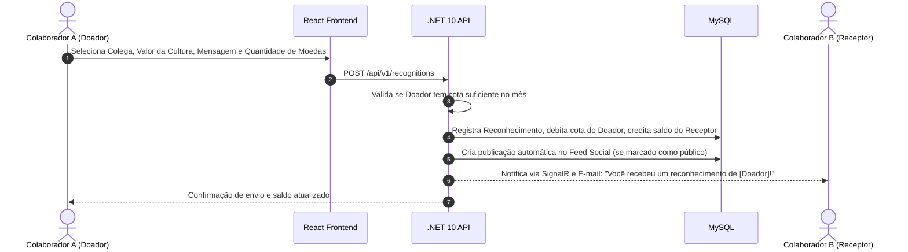

# Módulo 02: Reconhecimento & Gamificação

## 📌 Objetivo do Módulo

Incentivar uma cultura de gratidão, reconhecimento entre pares (*Peer-to-Peer Recognition*) e alinhamento prático com os **Valores Organizacionais**, utilizando mecânicas de gamificação e economia de pontos/moedas corporativas.

---

## 💎 Dinâmica de Moedas Corporativas (*SocialCoins*)

### 1. Regra de Cota Mensal de Envio (Distribuição)
- No primeiro dia útil de cada mês, todo colaborador recebe uma **cota fixa de moedas para doar** (ex: 100 moedas).
- **Regra anti-acumulação de doação**: As moedas não utilizadas para reconhecer colegas expiram no fim do mês. Isso incentiva o hábito frequente de elogiar.
- **Impossibilidade de auto-doação**: Um colaborador nunca pode enviar moedas para si mesmo.

### 2. Moedas Recebidas (Saldo Acumulado)
- As moedas que um colaborador **recebe** através de reconhecimentos são intransferíveis entre usuários, mas **nunca expiram** e vão para a sua **Carteira de Recompensas**.
- Esse saldo pode ser resgatado na **Loja Corporativa de Benefícios**.

---

## 🎖️ Fluxo de Envio de Reconhecimento

---

## 🏷️ Pilares de Reconhecimento

Cada reconhecimento enviado deve obrigatoriamente estar associado a pelo menos um **Pilar/Valor Cultural da Empresa**:
- Exemplo:
  - 🤝 *Foco no Cliente*
  - 💡 *Inovação Contínua*
  - 🚀 *Trabalho em Equipe*
  - 🎯 *Entrega com Qualidade*
  - 🛡️ *Transparência e Ética*

Isso permite que o RH extraia relatórios detalhados demonstrando quais valores estão mais vivos no dia a dia e quais precisam de reforço de comunicação.

---

## 🛍️ Loja Corporativa de Prêmios (Catálogo de Recompensas)

A plataforma disponibiliza um módulo de catálogo administrado pelo RH:
- **Itens Tangíveis**: Swag da empresa (mochila, caneca, fone de ouvido, camisa do time), livros corporativos.
- **Itens de Experiência / Bem-Estar**:
  - *Day-off no aniversário*
  - *Sexta-feira curta (sair 2h mais cedo)*
  - *Voucher de café da manhã ou livraria*
  - *Mentoria individual de 1h com a liderança C-Level*
- **Fluxo de Resgate**:
  1. O colaborador clica em "Resgatar Item" com seu saldo de moedas recebidas.
  2. O sistema bloqueia as moedas e emite um ticket para a equipe de RH/People Ops.
  3. O RH aprova e faz a entrega física ou envia o código digital, marcando a entrega como concluída.

---

## 🏆 Badges, Conquistas e Rankings

- **Badges Automáticas**:
  - *Top Reconhecido do Mês por Inovação*
  - *Colaborador Centenário (100 reconhecimentos recebidos)*
  - *Anjo da Guarda (reconhecido por suporte a outros times)*
- **Privacidade & Segurança Psicológica**: Rankings de moedas recebidas podem ser ativados ou desativados pela empresa no painel administrativo, evitando competitividade predatória em culturas que preferem foco em colaboração pura.
