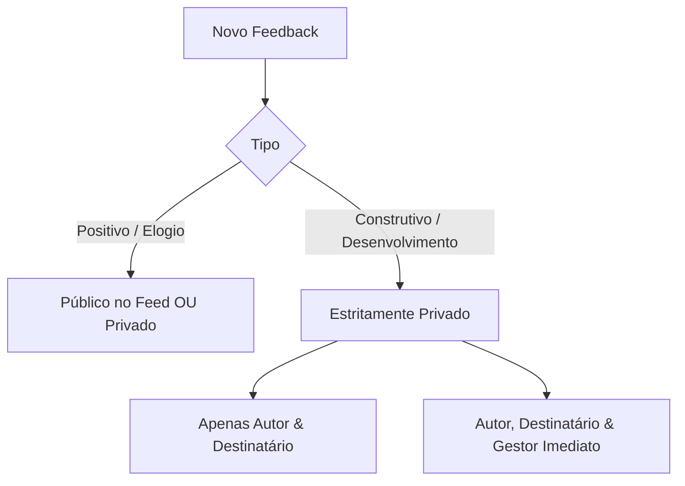
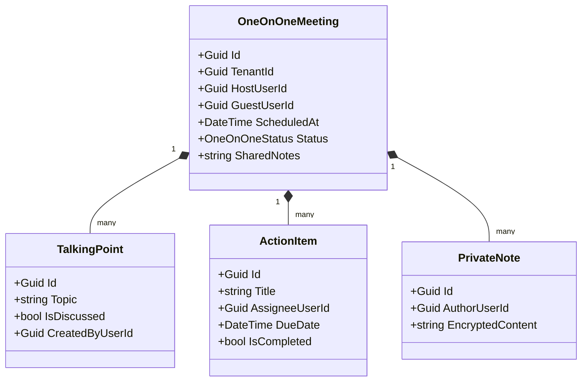

# Módulo 03: Feedback Contínuo & Reuniões 1-on-1

## 📌 Objetivo do Módulo

Estruturar o desenvolvimento individual das pessoas e fortalecer a relação entre líderes e liderados por meio de ciclos ágeis de escuta, orientação técnica/comportamental e alinhamento periódico de carreira e rotina.

---

## 💬 1. Feedback Contínuo

O SocialTool remove o atrito de esperar a avaliação anual para falar sobre acertos e oportunidades de evolução.

### Modos de Operação:
1. **Enviar Feedback Espontâneo**: O colaborador ou líder envia um feedback a qualquer colega da empresa.
2. **Solicitar Feedback**: O colaborador pode pedir a opinião de pares, clientes internos ou líderes sobre um projeto, apresentação ou período recente.

### Tipos e Níveis de Visibilidade:

> [!IMPORTANT]
> **Segurança Psicológica**: Feedbacks construtivos (oportunidades de melhoria) **nunca** podem ser postados publicamente no Feed Social. São sempre confidenciais.

---

## 🤝 2. Reuniões 1-on-1 (One-on-One)

O módulo de 1-on-1s profissionaliza as reuniões individuais periódicas (semanais, quinzenais ou mensais) entre líder e liderado, ou entre pares.

### Funcionalidades Essenciais:
1. **Pauta Colaborativa Prévia (*Talking Points*)**:
   - Tanto o líder quanto o liderado podem adicionar tópicos para discussão antes da reunião começar.
   - Cada tópico pode ser marcado como concluído durante a reunião.
2. **Histórico Integrado de Encontros**:
   - Visualização cronológica de todas as reuniões passadas com busca por termos e datas.
   - O histórico de feedbacks contínuos e reconhecimentos do período fica acessível na lateral da tela durante a 1-on-1.
3. **Notas Privadas (*Private Notes*)**:
   - Cada participante possui uma área de anotações que só ele pode enxergar (nem mesmo o outro participante tem acesso).
4. **Planos de Ação e Compromissos (*Action Items*)**:
   - Ao final do encontro, são definidos combinados:
     - *O que será feito?*
     - *Quem é o responsável?*
     - *Qual é o prazo acordado?*
   - Esses itens aparecem como pendências na próxima reunião até serem checados.

---

## 📈 Métricas para o RH (People Analytics)
- **Aderência aos Rituais de 1-on-1**: Percentual de reuniões agendadas vs. realizadas por liderança.
- **Cadência de Feedback**: Equipes que mais trocam feedbacks e departamentos com déficit de retorno.
- **Relatório de Acompanhamento de Ações**: Taxa de conclusão de compromissos gerados em 1-on-1s.
