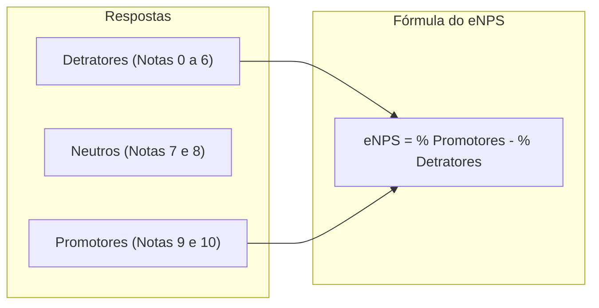

# Módulo 04: Pesquisas de Clima, Humor Diário & eNPS

## 📌 Objetivo do Módulo

Permitir que a organização meça continuamente a temperatura emocional, a satisfação com o ambiente de trabalho e o nível de lealdade dos colaboradores através de dados anônimos e estatisticamente confiáveis.

---

## 😊 1. Termômetro de Humor Diário (*Mood Tracker*)

Ao acessar a aplicação pela primeira vez no dia, o colaborador é convidado com uma interface minimalista e amigável para responder: *"Como você está se sentindo hoje?"*.

### Escala de 5 Emoções:
1. 🤩 **Excelente / Muito Motivado**
2. 🙂 **Bem / Satisfeito**
3. 😐 **Neutro / Normal**
4. 😕 **Desmotivado / Cansado**
5. 😫 **Estressado / Sobrecarregado**

- **Tags de Causa (Opcionais)**:
  - *Equipe*, *Gestão*, *Volume de Demandas*, *Saúde Pessoal*, *Ambiente Físico/Remoto*.
- **Comentário Confidencial Opcional**: Enviado de forma anônima para a caixa de escuta do RH.

---

## 📊 2. Cálculo e Gestão do eNPS (Employee Net Promoter Score)

A clássica pergunta periódica (geralmente trimestral):
> *"Em uma escala de 0 a 10, o quanto você recomendaria nossa empresa como um excelente lugar para se trabalhar?"*

### Faixas de Classificação do eNPS:
| Faixa | Score | Status |
| :--- | :--- | :--- |
| **Zona de Excelência** | +75 a +100 | Cultura exemplar e forte retenção |
| **Zona de Qualidade** | +50 a +74 | Bom nível de engajamento, pequenas correções |
| **Zona de Aperfeiçoamento** | 0 a +49 | Alerta: riscos de turnover e ruídos de liderança |
| **Zona Crítica** | -100 a -1 | Problemas graves de clima, gestão e retenção |

---

## 📋 3. Pesquisas de Pulso Customizadas (*Pulse Surveys*)

O RH pode criar campanhas de pesquisa pontuais ou recorrentes para investigar aspectos específicos da empresa:

- **Dimensões Avaliadas**:
  - Liderança Direta e Feedback
  - Remuneração, Benefícios e Reconhecimento
  - Ferramentas de Trabalho e Infraestrutura
  - Diversidade, Equidade e Inclusão (DEI)
  - Comunicação Interna e Transparência
- **Formatos de Perguntas**:
  - Escala Likert de 1 a 5 (Discordo Totalmente -> Concordo Totalmente)
  - Múltipla Escolha
  - Pergunta Aberta Textual com análise semântica de sentimento (positivo/neutro/negativo).

---

## 🛡️ Proteção de Anonimato & Regra do Quórum Mínimo

Para assegurar a verdade e proteger os colaboradores de retaliações:

1. **Quórum Mínimo de Exibição**:
   - Um líder ou o RH **nunca** pode visualizar o resultado segmentado de um time que tenha menos de **4 respondentes** na amostragem.
   - Caso um time tenha 3 pessoas, as respostas são consolidadas apenas no nível do departamento imediatamente superior.
2. **Desassociação de Identidade no Banco de Dados**:
   - As respostas de pesquisas anônimas não guardam chave estrangeira para o `user_id`. O registro contém apenas `tenant_id`, `survey_id`, dados demográficos consolidados (ex: `department_id`, faixa de tempo de casa) e as notas/textos.
   - O controle de "quem já respondeu" é mantido em uma tabela separada de tickets únicos (`SurveyParticipation`), que apenas registra se o usuário completou a pesquisa, sem ligar seu ID à resposta enviada.
