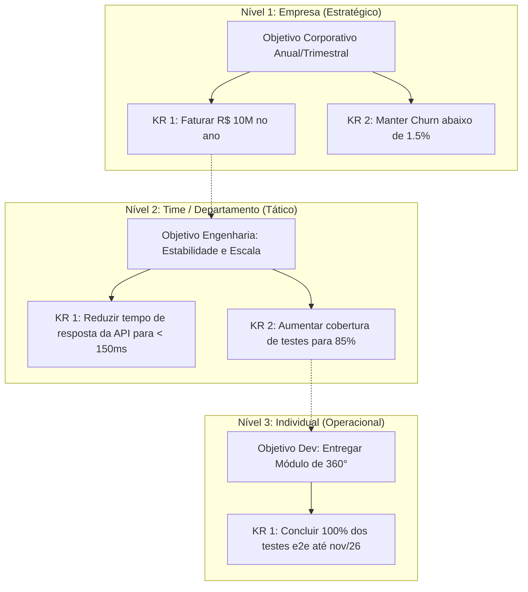

# Módulo 05: Gestão de OKRs & Metas

## 📌 Objetivo do Módulo

Garantir o alinhamento estratégico da organização através da metodologia de **OKRs (Objectives and Key Results)**, conectando o trabalho diário de cada colaborador aos grandes objetivos corporativos.

---

## 🌳 Hierarquia de Desdobramento

A plataforma adota o cascateamento e alinhamento em 3 níveis:

---

## 🎯 Estrutura de Dados de um OKR

### 1. Objetivo (O - Objective)
- Título inspiracional e qualitativo (ex: *"Oferecer uma experiência de suporte inesquecível ao cliente"*).
- Período / Ciclo de Vigência (Trimestral - Q1, Q2, Q3, Q4 ou Anual).
- Dono (*Owner*) do Objetivo (Líder da empresa, líder do time ou colaborador).
- Nível de Visibilidade (Público para toda a empresa ou restrito ao departamento).

### 2. Resultados-Chave (KR - Key Results)
- Título quantitativo e mensurável (ex: *"Aumentar o CSAT de 85% para 95%"*).
- Tipo de Métrica:
  - **Percentual (%)**: Ex: de 60% para 90%.
  - **Numérico Absoluto**: Ex: de 10 clientes para 50 clientes.
  - **Monetário (R$)**: Ex: de R$ 100.000 para R$ 250.000.
  - **Binário (Booleano)**: 0 ou 1 (Concluído / Não Concluído).
- Sentido da Meta:
  - *Crescer para* (ex: vendas de 100 para 200).
  - *Reduzir para* (ex: bugs de 50 para 5).
  - *Manter em* (ex: SLA entre 99% e 100%).

---

## ⏱️ Rituais de Check-in Periódico

Para evitar que metas fiquem esquecidas em documentos estáticos, o sistema cobra **Check-ins Semanais ou Quinzenais**:

1. **Atualização de Progresso**: O responsável altera o valor atual do KR.
2. **Nível de Confiança (*Confidence Score*)**:
   - 🟢 **No Caminho (On Track)**: Alta probabilidade de atingir a meta.
   - 🟡 **Em Risco (At Risk)**: Desafios identificados, requer atenção imediata.
   - 🔴 **Atrasado (Off Track)**: Travado ou muito distante da meta planejada.
3. **Nota de Contexto**: Breve justificativa do que aconteceu na semana (bloqueios, vitórias, correções de rota).

---

## 📊 Cálculo de Progresso em Cascata

- O progresso de cada **KR** é calculado automaticamente:
  $$\text{Progresso do KR} = \frac{\text{Valor Atual} - \text{Valor Inicial}}{\text{Valor Alvo} - \text{Valor Inicial}} \times 100$$
- O progresso do **Objetivo** é a média ponderada (ou simples) dos seus Key Results:
  $$\text{Progresso do Objetivo} = \frac{\sum \text{Progresso dos KRs}}{N}$$
- Gráficos no dashboard do React exibem curvas de *Burn-up* e projeção estimada de conclusão até a data final do ciclo.
