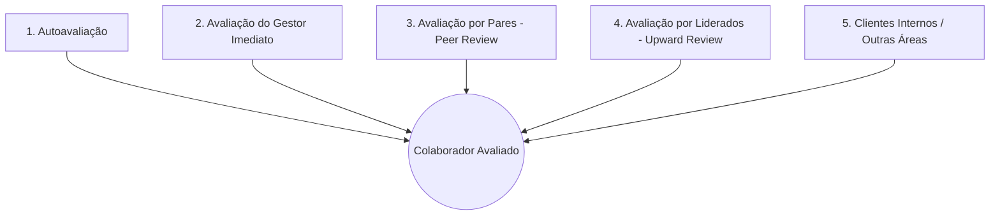

# Módulo 06: Avaliação de Desempenho & Avaliação 360°

## 📌 Objetivo do Módulo

Permitir ciclos profissionais de avaliação de performance, potencial e competências, eliminando vieses por meio da visão multidirecional (360 Graus), calibrando talentos na **Matriz 9-Box** e gerando **Planos de Desenvolvimento Individual (PDI)** claros.

---

## 🔄 1. Ciclo de Avaliação 360 Graus

Uma avaliação 360° coleta perspectivas de todos os ângulos de convivência profissional do colaborador:



### Etapas Operacionais de um Ciclo de Avaliação:
1. **Configuração pelo RH**:
   - Definição do período, questionários de competências e pesos (ex: Gestor 50%, Autoavaliação 20%, Pares 20%, Liderados 10%).
2. **Indicação e Aprovação de Avaliadores**:
   - O colaborador indica 3 a 5 colegas com quem trabalhou no ciclo.
   - O gestor imediato aprova ou ajusta a lista de avaliadores.
3. **Preenchimento dos Formulários**:
   - Respostas de competências com notas graduadas (escala de 1 a 5 com âncoras de comportamento) e justificativas textuais obrigatórias para notas extremas.
4. **Comitê de Calibração**:
   - O RH e a diretoria reúnem os gestores para nivelar critérios e evitar líderes "muito bonzinhos" ou "excessivamente rigorosos".
5. **Devolutiva e Reunião de Feedback**:
   - Gestor e colaborador analisam os relatórios de concordância/discrepância (ex: o colaborador se avaliou nota 5, mas os pares deram nota 2).
6. **Criação do PDI**:
   - Estabelecimento de metas de aprendizado e mentorias para os gaps detectados.

---

## 🧩 2. Critérios e Modelo de Competências

As avaliações são compostas por blocos parametrizáveis pelo RH:

| Bloco | Descrição | Exemplo |
| :--- | :--- | :--- |
| **Competências Institucionais** | Valores e comportamentos esperados de todos na empresa. | Ética, Inovação, Espírito de Equipe. |
| **Competências Técnicas** | Conhecimentos específicos requeridos para o cargo/nível. | Arquitetura de Software, Análise Financeira, Copywriting. |
| **Competências de Liderança** | Aplicáveis a cargos com gestão de pessoas. | Gestão de Conflitos, Desenvolvimento do Time, Visão Estratégica. |
| **Metas / Entregas** | Avaliação do atingimento dos OKRs e KPIs do período. | % de conclusão dos Key Results individuais. |

---

## 📦 3. Matriz 9-Box (Desempenho x Potencial)

A clássica ferramenta de talent mapping calcula a posição do colaborador em uma grade de 9 quadrantes baseada no cruzamento de:
- **Eixo X**: Nível de Entrega / Desempenho (Atingimento de metas e competências técnicas).
- **Eixo Y**: Potencial de Crescimento e Liderança (Agilidade de aprendizado e competências comportamentais).

```
POTENCIAL
   ▲
   │ [ Enigma / Dilema ]      [ Alto Potencial ]        [ Estrela / Top Talent ]
ALTO│ (Baixo Desempenho /      (Médio Desempenho /       (Alto Desempenho /
   │  Alto Potencial)           Alto Potencial)           Alto Potencial)
   ├──────────────────────────┼─────────────────────────┼────────────────────────
   │ [ Questionável ]         [ Mantenedor / Core ]     [ Forte Desempenho ]
MED│ (Baixo Desempenho /      (Médio Desempenho /       (Alto Desempenho /
   │  Médio Potencial)          Médio Potencial)          Médio Potencial)
   ├──────────────────────────┼─────────────────────────┼────────────────────────
   │ [ Risco / Insuficiente ] [ Eficaz / Especialista ] [ Confiável / Mestre ]
BAIXO (Baixo Desempenho /     (Médio Desempenho /       (Alto Desempenho /
   │  Baixo Potencial)          Baixo Potencial)          Baixo Potencial)
   └──────────────────────────┴─────────────────────────┴────────────────────────►
              BAIXO                     MÉDIO                     ALTO      DESEMPENHO
```

### Funcionalidade de Arrastar e Soltar (*Drag-and-Drop Calibration*):
No painel do RH, os colaboradores aparecem como cards dentro dos quadrantes calculados pela fórmula. O comitê de calibração pode arrastar os colaboradores entre os quadrantes, registrando um histórico de justificativa da alteração.

---

## 🎯 4. Plano de Desenvolvimento Individual (PDI)

O PDI consolida o plano pós-avaliação:
- **Objetivo de Desenvolvimento**: Ex: *"Aprimorar comunicação executiva para apresentações de diretoria"*.
- **Ações 70-20-10**:
  - *70% Experiência Prática*: Liderar reunião de alinhamento com clientes chave.
  - *20% Troca / Social*: Sessões quinzenais de mentoria com Diretor de Vendas.
  - *10% Formal*: Conclusão de curso de storytelling executivo.
- **Prazos e Acompanhamento**: Integrado diretamente às pautas das reuniões de 1-on-1.
