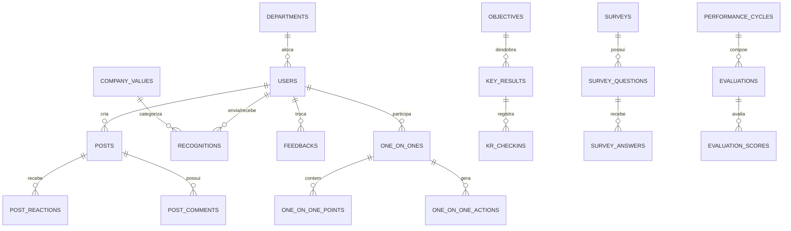

# 04. Modelo de Dados Relacional (MySQL 8.4+)

## 📌 Visão Geral do Modelo de Dados

O modelo relacional é projetado para **MySQL 8.4+ LTS**, utilizando o charset `utf8mb4` e a collation `utf8mb4_unicode_ci` para suportar plenamente emojis, caracteres internacionais e formatações ricas.

Cada instalação atende **uma única organização**, então as tabelas não carregam chave de empresa: a configuração da organização (nome, moeda, cota, integrações) fica na tabela `organization`, que tem uma só linha. Os índices cobrem as colunas de filtro e ordenação mais usadas.

---

## 🗂️ Diagrama Entidade-Relacionamento (Conceitual)



---

## 🏛️ DDL - Principais Tabelas (Sintaxe MySQL)

### 1. Organização e Usuários

```sql
CREATE TABLE organization (
    id CHAR(36) NOT NULL PRIMARY KEY,
    name VARCHAR(150) NOT NULL,
    logo_url VARCHAR(500) NULL,
    currency_name VARCHAR(50) NOT NULL DEFAULT 'SocialCoins',
    monthly_coins_quota INT NOT NULL DEFAULT 100,
    google_workspace_domain VARCHAR(200) NULL,
    created_at DATETIME NOT NULL DEFAULT CURRENT_TIMESTAMP,
    updated_at DATETIME NOT NULL DEFAULT CURRENT_TIMESTAMP ON UPDATE CURRENT_TIMESTAMP
) ENGINE=InnoDB DEFAULT CHARSET=utf8mb4 COLLATE=utf8mb4_unicode_ci;

CREATE TABLE departments (
    id CHAR(36) NOT NULL PRIMARY KEY,
    parent_department_id CHAR(36) NULL,
    name VARCHAR(100) NOT NULL,
    leader_id CHAR(36) NULL,
    created_at DATETIME NOT NULL DEFAULT CURRENT_TIMESTAMP
) ENGINE=InnoDB DEFAULT CHARSET=utf8mb4 COLLATE=utf8mb4_unicode_ci;

CREATE TABLE users (
    id CHAR(36) NOT NULL PRIMARY KEY,
    department_id CHAR(36) NULL,
    manager_id CHAR(36) NULL,
    name VARCHAR(150) NOT NULL,
    email VARCHAR(200) NOT NULL,
    password_hash VARCHAR(500) NULL, -- nulo enquanto o convite não é aceito ou para quem só entra pelo Google
    job_title VARCHAR(100) NOT NULL,
    birth_date DATE NULL,
    hire_date DATE NOT NULL,
    avatar_url VARCHAR(500) NULL,
    role VARCHAR(30) NOT NULL DEFAULT 'Employee', -- 'Admin', 'HR', 'Leader', 'Employee'
    coins_available_to_give INT NOT NULL DEFAULT 0,
    coins_balance_to_spend INT NOT NULL DEFAULT 0,
    is_active BOOLEAN NOT NULL DEFAULT TRUE,
    created_at DATETIME NOT NULL DEFAULT CURRENT_TIMESTAMP,
    updated_at DATETIME NOT NULL DEFAULT CURRENT_TIMESTAMP ON UPDATE CURRENT_TIMESTAMP,
    UNIQUE KEY uk_user_email (email),
    INDEX idx_users_manager (manager_id),
    CONSTRAINT fk_users_dept FOREIGN KEY (department_id) REFERENCES departments(id) ON DELETE SET NULL,
    CONSTRAINT fk_users_manager FOREIGN KEY (manager_id) REFERENCES users(id) ON DELETE SET NULL
) ENGINE=InnoDB DEFAULT CHARSET=utf8mb4 COLLATE=utf8mb4_unicode_ci;
```

---

### 2. Módulo de Feed Social & Reconhecimento

```sql
CREATE TABLE company_values (
    id CHAR(36) NOT NULL PRIMARY KEY,
    title VARCHAR(100) NOT NULL,
    description TEXT NULL,
    badge_icon_url VARCHAR(500) NULL,
    color_hex VARCHAR(10) NULL,
    is_active BOOLEAN NOT NULL DEFAULT TRUE,
    created_at DATETIME NOT NULL DEFAULT CURRENT_TIMESTAMP
) ENGINE=InnoDB DEFAULT CHARSET=utf8mb4 COLLATE=utf8mb4_unicode_ci;

CREATE TABLE posts (
    id CHAR(36) NOT NULL PRIMARY KEY,
    author_id CHAR(36) NOT NULL,
    post_type VARCHAR(30) NOT NULL DEFAULT 'Standard', -- 'Standard', 'Announcement', 'Birthday', 'Anniversary', 'Recognition'
    content TEXT NOT NULL,
    image_url VARCHAR(500) NULL,
    is_pinned BOOLEAN NOT NULL DEFAULT FALSE,
    is_moderated BOOLEAN NOT NULL DEFAULT FALSE,
    created_at DATETIME NOT NULL DEFAULT CURRENT_TIMESTAMP,
    updated_at DATETIME NOT NULL DEFAULT CURRENT_TIMESTAMP ON UPDATE CURRENT_TIMESTAMP,
    INDEX idx_posts_created (created_at DESC),
    CONSTRAINT fk_posts_author FOREIGN KEY (author_id) REFERENCES users(id) ON DELETE CASCADE
) ENGINE=InnoDB DEFAULT CHARSET=utf8mb4 COLLATE=utf8mb4_unicode_ci;

CREATE TABLE recognitions (
    id CHAR(36) NOT NULL PRIMARY KEY,
    post_id CHAR(36) NULL, -- Se associado a uma publicação no feed
    sender_id CHAR(36) NOT NULL,
    receiver_id CHAR(36) NOT NULL,
    company_value_id CHAR(36) NOT NULL,
    coins_transferred INT NOT NULL DEFAULT 0,
    message TEXT NOT NULL,
    is_public BOOLEAN NOT NULL DEFAULT TRUE,
    created_at DATETIME NOT NULL DEFAULT CURRENT_TIMESTAMP,
    INDEX idx_recog_receiver (receiver_id),
    CONSTRAINT fk_recog_sender FOREIGN KEY (sender_id) REFERENCES users(id) ON DELETE CASCADE,
    CONSTRAINT fk_recog_receiver FOREIGN KEY (receiver_id) REFERENCES users(id) ON DELETE CASCADE,
    CONSTRAINT fk_recog_val FOREIGN KEY (company_value_id) REFERENCES company_values(id) ON DELETE RESTRICT
) ENGINE=InnoDB DEFAULT CHARSET=utf8mb4 COLLATE=utf8mb4_unicode_ci;
```

---

### 3. Feedback Contínuo & 1-on-1s

```sql
CREATE TABLE feedbacks (
    id CHAR(36) NOT NULL PRIMARY KEY,
    sender_id CHAR(36) NOT NULL,
    receiver_id CHAR(36) NOT NULL,
    feedback_type VARCHAR(20) NOT NULL, -- 'Positive', 'Constructive'
    visibility VARCHAR(20) NOT NULL, -- 'Public', 'Private', 'IncludeManager'
    content TEXT NOT NULL,
    created_at DATETIME NOT NULL DEFAULT CURRENT_TIMESTAMP,
    INDEX idx_feedback_users (receiver_id, sender_id)
) ENGINE=InnoDB DEFAULT CHARSET=utf8mb4 COLLATE=utf8mb4_unicode_ci;

CREATE TABLE one_on_ones (
    id CHAR(36) NOT NULL PRIMARY KEY,
    host_user_id CHAR(36) NOT NULL,
    guest_user_id CHAR(36) NOT NULL,
    scheduled_at DATETIME NOT NULL,
    conducted_at DATETIME NULL,
    status VARCHAR(20) NOT NULL DEFAULT 'Scheduled', -- 'Scheduled', 'Completed', 'Canceled'
    shared_notes MEDIUMTEXT NULL,
    created_at DATETIME NOT NULL DEFAULT CURRENT_TIMESTAMP,
    INDEX idx_1on1_participants (host_user_id, guest_user_id)
) ENGINE=InnoDB DEFAULT CHARSET=utf8mb4 COLLATE=utf8mb4_unicode_ci;

CREATE TABLE one_on_one_action_items (
    id CHAR(36) NOT NULL PRIMARY KEY,
    one_on_one_id CHAR(36) NOT NULL,
    assignee_id CHAR(36) NOT NULL,
    title VARCHAR(250) NOT NULL,
    due_date DATE NULL,
    is_completed BOOLEAN NOT NULL DEFAULT FALSE,
    completed_at DATETIME NULL,
    INDEX idx_1on1_actions (assignee_id, is_completed),
    CONSTRAINT fk_1on1_action_parent FOREIGN KEY (one_on_one_id) REFERENCES one_on_ones(id) ON DELETE CASCADE
) ENGINE=InnoDB DEFAULT CHARSET=utf8mb4 COLLATE=utf8mb4_unicode_ci;
```

---

### 4. Gestão de OKRs

```sql
CREATE TABLE objectives (
    id CHAR(36) NOT NULL PRIMARY KEY,
    parent_objective_id CHAR(36) NULL,
    owner_id CHAR(36) NOT NULL,
    department_id CHAR(36) NULL,
    title VARCHAR(250) NOT NULL,
    cycle_quarter VARCHAR(10) NOT NULL, -- '2026-Q1', '2026-Q2', etc.
    scope_level VARCHAR(20) NOT NULL DEFAULT 'Company', -- 'Company', 'Department', 'Individual'
    progress_percentage DECIMAL(5,2) NOT NULL DEFAULT 0.00,
    created_at DATETIME NOT NULL DEFAULT CURRENT_TIMESTAMP,
    INDEX idx_okr_cycle (cycle_quarter)
) ENGINE=InnoDB DEFAULT CHARSET=utf8mb4 COLLATE=utf8mb4_unicode_ci;

CREATE TABLE key_results (
    id CHAR(36) NOT NULL PRIMARY KEY,
    objective_id CHAR(36) NOT NULL,
    owner_id CHAR(36) NOT NULL,
    title VARCHAR(250) NOT NULL,
    metric_type VARCHAR(20) NOT NULL DEFAULT 'Percentage', -- 'Percentage', 'Numeric', 'Currency', 'Boolean'
    initial_value DECIMAL(12,2) NOT NULL DEFAULT 0.00,
    target_value DECIMAL(12,2) NOT NULL,
    current_value DECIMAL(12,2) NOT NULL DEFAULT 0.00,
    confidence_status VARCHAR(20) NOT NULL DEFAULT 'OnTrack', -- 'OnTrack', 'AtRisk', 'OffTrack'
    weight DECIMAL(3,2) NOT NULL DEFAULT 1.00,
    created_at DATETIME NOT NULL DEFAULT CURRENT_TIMESTAMP,
    INDEX idx_kr_obj (objective_id),
    CONSTRAINT fk_kr_objective FOREIGN KEY (objective_id) REFERENCES objectives(id) ON DELETE CASCADE
) ENGINE=InnoDB DEFAULT CHARSET=utf8mb4 COLLATE=utf8mb4_unicode_ci;
```

---

### 5. Pesquisas de Clima & Humor

```sql
CREATE TABLE daily_moods (
    id CHAR(36) NOT NULL PRIMARY KEY,
    user_id CHAR(36) NOT NULL,
    department_id CHAR(36) NOT NULL,
    mood_level TINYINT NOT NULL, -- 1 a 5
    reason_category VARCHAR(50) NULL,
    confidential_comment TEXT NULL,
    recorded_date DATE NOT NULL,
    created_at DATETIME NOT NULL DEFAULT CURRENT_TIMESTAMP,
    UNIQUE KEY uk_mood_user_date (user_id, recorded_date),
    INDEX idx_mood_dept_date (department_id, recorded_date)
) ENGINE=InnoDB DEFAULT CHARSET=utf8mb4 COLLATE=utf8mb4_unicode_ci;
```

---

### 6. Avaliação de Desempenho 360° & 9-Box

```sql
CREATE TABLE performance_cycles (
    id CHAR(36) NOT NULL PRIMARY KEY,
    name VARCHAR(150) NOT NULL, -- Ex: 'Ciclo Anual de Avaliação 2026'
    start_date DATE NOT NULL,
    end_date DATE NOT NULL,
    status VARCHAR(30) NOT NULL DEFAULT 'Planning', -- 'Planning', 'PeerSelection', 'Evaluating', 'Calibrating', 'Feedback', 'Closed'
    created_at DATETIME NOT NULL DEFAULT CURRENT_TIMESTAMP
) ENGINE=InnoDB DEFAULT CHARSET=utf8mb4 COLLATE=utf8mb4_unicode_ci;

CREATE TABLE evaluations (
    id CHAR(36) NOT NULL PRIMARY KEY,
    performance_cycle_id CHAR(36) NOT NULL,
    evaluated_user_id CHAR(36) NOT NULL,
    evaluator_user_id CHAR(36) NOT NULL,
    relationship_type VARCHAR(20) NOT NULL, -- 'Self', 'Manager', 'Peer', 'Subordinate'
    is_submitted BOOLEAN NOT NULL DEFAULT FALSE,
    submitted_at DATETIME NULL,
    INDEX idx_eval_cycle (performance_cycle_id, evaluated_user_id),
    CONSTRAINT fk_eval_cycle FOREIGN KEY (performance_cycle_id) REFERENCES performance_cycles(id) ON DELETE CASCADE
) ENGINE=InnoDB DEFAULT CHARSET=utf8mb4 COLLATE=utf8mb4_unicode_ci;

CREATE TABLE nine_box_placements (
    id CHAR(36) NOT NULL PRIMARY KEY,
    performance_cycle_id CHAR(36) NOT NULL,
    user_id CHAR(36) NOT NULL,
    performance_score TINYINT NOT NULL, -- 1: Baixo, 2: Médio, 3: Alto
    potential_score TINYINT NOT NULL,   -- 1: Baixo, 2: Médio, 3: Alto
    calibrated_by_user_id CHAR(36) NULL,
    calibration_reason TEXT NULL,
    updated_at DATETIME NOT NULL DEFAULT CURRENT_TIMESTAMP ON UPDATE CURRENT_TIMESTAMP,
    UNIQUE KEY uk_9box_user_cycle (performance_cycle_id, user_id)
) ENGINE=InnoDB DEFAULT CHARSET=utf8mb4 COLLATE=utf8mb4_unicode_ci;
```
