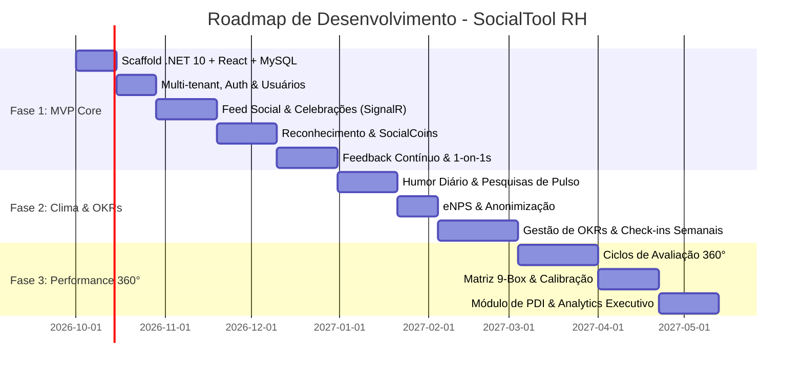

# 06. Roadmap e Fases de Implementação

## 🗺️ Visão Geral do Roadmap de Desenvolvimento

O projeto é estruturado em **3 fases estratégicas**, permitindo lançar valor rápido para os colaboradores no dia a dia (MVP com foco social e conexão) e progressivamente introduzir os módulos de gestão estratégica e avaliação de desempenho.

---

## 🎯 Detalhamento das Fases

### 🚀 Fase 1: MVP Core (Foco em Conexão e Rituais)
- **Objetivo**: Fazer o colaborador acessar a plataforma diariamente e sentir impacto imediato na comunicação e reconhecimento.
- **Entregas**:
  - Infraestrutura básica (.NET 10 Web API, React + Vite + Tailwind, MySQL 8.4).
  - Autenticação JWT com isolamento multi-tenant (`TenantId`).
  - Organograma de departamentos e perfis de colaboradores.
  - **Feed Social em tempo real**:
    - Criação de postagens, reações ricas e comentários.
    - Automação de aniversários de vida, empresa e boas-vindas.
  - **Reconhecimento & SocialCoins**:
    - Elogios vinculados aos valores da empresa.
    - Carteira de moedas e extrato mensal de doação.
  - **Feedback Contínuo & 1-on-1**:
    - Envio e solicitação de feedback com controle de privacidade.
    - Agendamento de 1-on-1, pautas colaborativas e planos de ação.

---

### 📊 Fase 2: Clima, Escuta Ativa & Alinhamento Estratégico
- **Objetivo**: Fornecer ao RH e aos líderes visibilidade sobre a saúde emocional da equipe e direcionamento de metas.
- **Entregas**:
  - **Termômetro Diário de Humor**:
    - Popup diário de check-in emocional de 5 estados.
    - Dashboard de evolução de humor da equipe (com filtro de quórum >= 4).
  - **Pesquisas de Pulso e eNPS**:
    - Criação de campanhas de pesquisa pelo RH.
    - Motor de cálculo de eNPS (% Promotores - % Detratores).
    - Desassociação estrita de identidade nas respostas.
  - **Gestão de OKRs**:
    - Cadastro de Objetivos da Empresa, Departamentos e Indivíduos.
    - Key Results com métricas percentuais, monetárias e numéricas.
    - Fluxo de check-in quinzenal com status de confiança e cálculo em cascata.

---

### 🌟 Fase 3: Desempenho 360°, 9-Box & People Analytics
- **Objetivo**: Fechar o ciclo anual/semestral de desenvolvimento de talentos com ferramentas executivas e de calibração.
- **Entregas**:
  - **Ciclos de Avaliação 360 Graus**:
    - Matriz de avaliadores (autoavaliação, gestor, pares e liderados).
    - Banco de competências comportamentais e técnicas.
    - Relatório visual de concordâncias e divergências (gráfico radar).
  - **Matriz 9-Box Interativa**:
    - Posicionamento automático (Desempenho x Potencial).
    - Painel com drag-and-drop para comitê de calibração do RH.
  - **PDI (Plano de Desenvolvimento Individual)**:
    - Metas de desenvolvimento integradas ao histórico de 1-on-1s.
  - **Dashboard Executivo de People Analytics**:
    - Cruzamento de dados de engajamento no feed, humor, metas batidas e notas de avaliação de desempenho.
