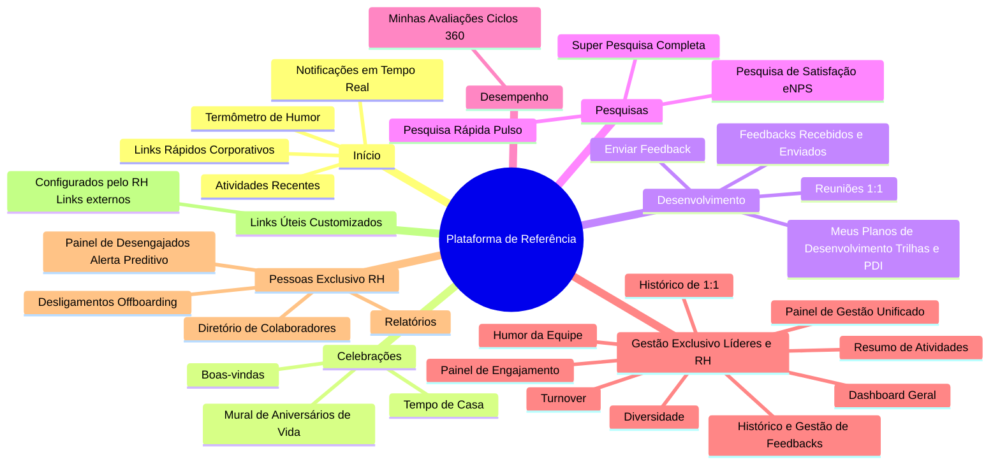

# 07. Análise Estrutural de Plataforma de Referência

> Documento gerado a partir da inspeção direta da interface de produção de uma plataforma de referência de mercado utilizada pela organização do usuário. Material interno de estudo — orienta as decisões de arquitetura de informação do SocialTool RH.

---

## 🧭 Arquitetura de Informação Real da Plataforma

---

## 🔍 Detalhamento das Descobertas e Componentes

### 1. Widget do Termômetro de Humor Diário
A plataforma de referência posiciona o termômetro logo no topo da página inicial (`/inicio`), tornando o check-in um hábito instantâneo ao logar:
- **5 Estados Emocionais**:
  1. 😫 **Muito triste** (`mood-1`)
  2. 🙁 **Triste** (`mood-2`)
  3. 😐 **Neutro** (`mood-3`)
  4. 🙂 **Feliz** (`mood-4`)
  5. 🤩 **Muito feliz** (`mood-5`)
- **Interação**: Seleção por rádio/imagem + botão de confirmação `"Enviar humor"`.

### 2. Timeline de "Atividades Recentes"
Diferente de um feed comum que só tem posts manuais, a timeline agrega **eventos operacionais e sociais**:
- Exibição de quando um colaborador *"respondeu o Termômetro de Humor"* (preservando a nota de forma anônima, mas incentivando a participação coletiva).
- Novos feedbacks recebidos e reconhecimentos públicos.
- Posts e comunicados fixados.

### 3. As 3 Modalidades de Pesquisas
A plataforma divide pesquisas em 3 ferramentas distintas:
1. **Pesquisa de Satisfação (`/enps`)**: Pergunta canônica de eNPS (0 a 10) + motivo/comentário confidencial, executada com cadência trimestral ou semestral.
2. **Pesquisa Rápida (`/pesquisa-rapida`)**: Perguntas de pulso único (ex: *"Como foi a convenção de vendas ontem?"* ou *"A nova política de home-office está clara?"*).
3. **Super Pesquisa (`/super-pesquisa`)**: Pesquisa diagnóstica aprofundada com dezenas de perguntas agrupadas por temas (Liderança, Remuneração, Clima, Segurança Psicológica).

### 4. Inteligência de Pessoas & Retenção
Dois módulos de alto valor estratégico observados:
- **Painel de Desengajados (`/empresa/colaboradoresdes`)**:
  - Algoritmo que pontua colaboradores com sinais de alerta:
    - Queda abrupta no humor diário.
    - Ausência de 1-on-1 nos últimos 30-45 dias.
    - Baixa quantidade de feedbacks recebidos ou doados.
    - Falta de resposta em pesquisas de clima.
  - Alerta preventivo para o RH e líder atuarem antes do pedido de demissão.
- **Módulo de Turnover (`/turnover`)**:
  - Acompanhamento da taxa de rotatividade (admissões vs. desligamentos) com motivos de saída catalogados em entrevistas de desligamento.

### 5. Links Úteis e Customizados da Empresa
A barra lateral possui uma seção dinâmica onde o RH pode cadastrar links externos para ferramentas da rotina da empresa (ex: Abertura de chamados de TI/Facilities, Políticas internas em armazenamento em nuvem, Portal de benefícios/Lojinha).
